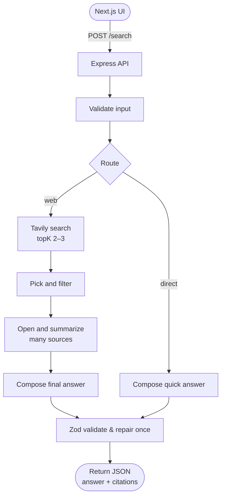

## `Search Agent Workflow`
 

```mermaid
flowchart TD
    A([Next.js UI]) -->|POST /search| B[Express API]
    B --> C[Validate input]
    C --> D{Route}
 
    D -->|web| E[Tavily search\ntopK 2–3]
    E --> F[Pick and filter]
    F --> G[Open and summarize\nmany sources]
    G --> H[Compose final answer]
 
    D -->|direct| I[Compose quick answer]
 
    H --> J[Zod validate & repair once]
    I --> J
 
    J --> K([Return JSON\nanswer + citations])
```