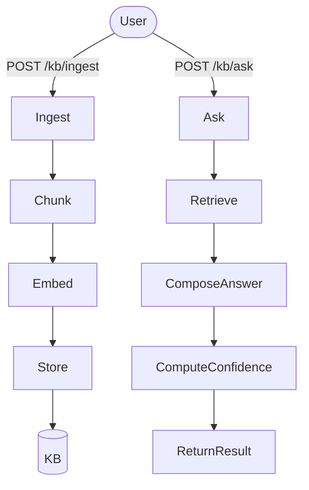

# Light RAG API Flow

```mermaid
flowchart TD
    User([User])

    User -->|POST /kb/ingest| Ingest
    User -->|POST /kb/ask| Ask

    Ingest --> Chunk
    Chunk --> Embed
    Embed --> Store
    Store --> KB[(KB)]

    Ask --> Retrieve
    Retrieve --> ComposeAnswer
    ComposeAnswer --> ComputeConfidence
    ComputeConfidence --> ReturnResult
```