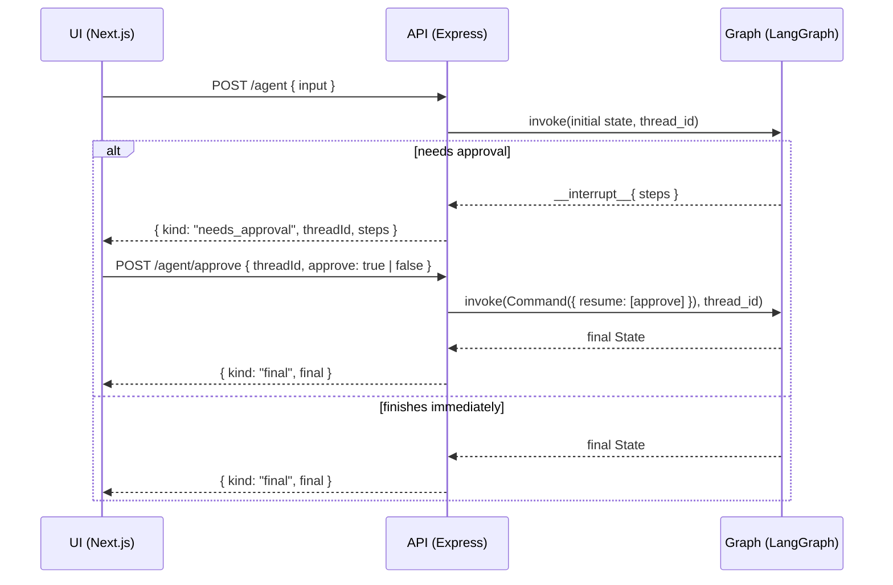
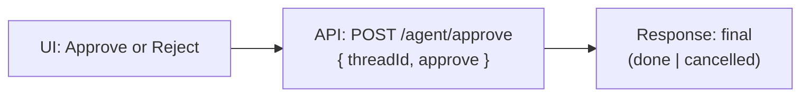

# LangGraph Task Approval Agent

## Sequence Diagram

```mermaid
sequenceDiagram
    participant UI as UI (Next.js)
    participant API as API (Express)
    participant Graph as Graph (LangGraph)

    UI->>API: POST /agent { input }
    API->>Graph: invoke(initial state, thread_id)

    alt needs approval
        Graph-->>API: __interrupt__{ steps }
        API-->>UI: { kind: "needs_approval", threadId, steps }

        UI->>API: POST /agent/approve { threadId, approve: true | false }
        API->>Graph: invoke(Command({ resume: [approve] }), thread_id)
        Graph-->>API: final State
        API-->>UI: { kind: "final", final }

    else finishes immediately
        Graph-->>API: final State
        API-->>UI: { kind: "final", final }
    end
```

## Approval Step

```mermaid
flowchart LR
    A[UI: Approve or Reject] --> B["API: POST /agent/approve\n{ threadId, approve }"]
    B --> C["Response: final\n(done | cancelled)"]
```
