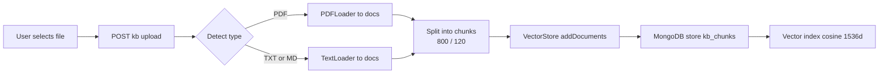

# System Flowcharts

## 1. Knowledge Base Upload Pipeline

```mermaid
flowchart LR
    A[User selects file] --> B[POST kb upload]
    B --> C{Detect type}
    C -- PDF --> D[PDFLoader to docs]
    C -- TXT or MD --> E[TextLoader to docs]
    D --> F[Split into chunks\n800 / 120]
    E --> F
    F --> G[VectorStore addDocuments]
    G --> H[MongoDB store kb_chunks]
    H --> I[Vector index cosine 1536d]
```

---

## 2. Agent Query Pipeline

```mermaid
flowchart TD
    A[UI sends message] --> B[Ensure threadId]
    B --> C[Load chat history from Mongo]
    C --> D[Run agent with kb search]
    D --> E[Vector search in default namespace]
    E --> F[Pick top chunks]
    F --> G[Compose answer with citations]
    G --> H[Save assistant message in Mongo]
    H --> I[Send answer to UI]
```